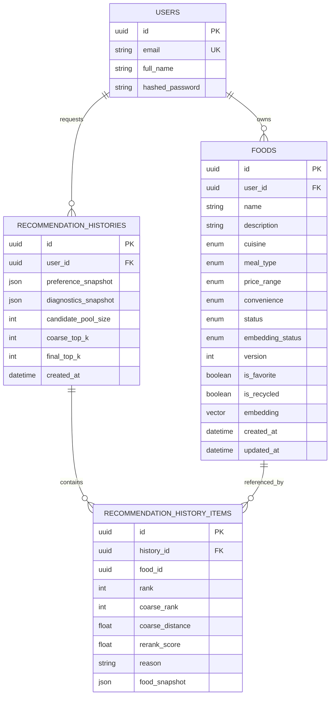
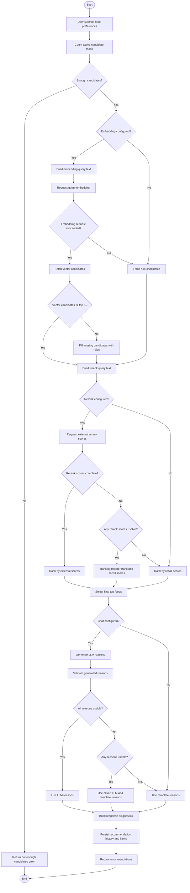

# what2eat

[GitHub Repository](https://github.com/userstarwind/what2eat)

## Overview

As the old saying goes: "I examine myself three times a day - What should I eat
for breakfast? What should I eat for lunch? What should I eat for dinner?"

Every day, choosing what to eat can become a small but exhausting decision.
What2Eat is a food recommendation web system designed to reduce decision
fatigue by turning meal selection into a simple, structured, and playful
experience. Instead of endlessly thinking, scrolling through delivery apps, or
asking friends for ideas, users can let What2Eat quickly suggest suitable food
options based on their own preferences and saved food collection.

What2Eat is built as a modern full-stack web application with an interactive
React frontend, a FastAPI backend, PostgreSQL storage, Redis caching, and an
AI-enhanced recommendation workflow. Users can manage their own food library,
mark favorite items, recycle inactive foods, and request recommendations using
filters such as cuisine, meal type, price range, convenience, favorite-only
scope, and free-text extra requests.

The recommendation workflow is designed to be useful beyond simple randomness.
It can use embedding-based recall to find semantically relevant food candidates,
external reranking to improve ordering, and optional chat models to generate
short recommendation reasons. When model services are unavailable or partial
results are returned, What2Eat falls back to rule-based recall, recall-score
ranking, and template reasons, while recording diagnostics so users can see how
each recommendation was produced.

The system also keeps recommendation history. Each saved history record stores
the original preference snapshot, candidate pool size, recommendation items,
scores, reasons, and fallback diagnostics. This makes past decisions traceable
and gives users a lightweight way to revisit meals they previously considered.

## AI Statement

I have used AI tools in completing this work.

The automated writing and generative AI tools used include ChatGPT/Codex for
planning, drafting, editing, and reviewing parts of the project documentation
and code implementation. These tools were used to help generate ideas, suggest
code structure, assist with debugging, identify possible implementation issues,
improve wording, and refine explanations of the system design and
recommendation workflow.

All AI-assisted outputs were reviewed and adapted before inclusion. The final
content, implementation decisions, and submitted work remain my responsibility.

## At A Glance

`what2eat` includes:

- `server`: FastAPI + PostgreSQL + Redis
- `web`: React + Vite
- OpenAI-compatible model provider for embeddings, rerank, and optional chat reasons

## Prerequisites

- Docker + Docker Compose
- Python 3.12+
- `uv`
- Node.js 20+
- `pnpm`
- one OpenAI-compatible model provider, such as vLLM, SGLang, LM Studio, or a cloud API

## Ports

- Frontend: `http://localhost:5173`
- Backend API: `http://localhost:8080`
- Local model provider example: `http://localhost:8001`
- PostgreSQL: `127.0.0.1:5432`
- Redis: `127.0.0.1:6379`

## 1. Start PostgreSQL And Redis

From the project root:

```bash
docker compose up -d
```

## 2. Start A Model Provider

Run a model provider first if you want embedding-based recall or LLM-generated reasons. The backend speaks OpenAI-compatible HTTP APIs and is not tied to one provider.

Example vLLM embedding server:

```bash
vllm serve /home/starwind/projects/model_workspace/models/Qwen3-Embedding-0.6B \
  --served-model-name Qwen3-Embedding-0.6B \
  --port 8001 \
  --max-model-len 8192 \
  --trust-remote-code
```

Example backend model config:

```text
EMBEDDING_ENDPOINT=http://127.0.0.1:8001/v1/embeddings
EMBEDDING_MODEL=Qwen3-Embedding-0.6B
```

SGLang, LM Studio, and cloud providers can be used by pointing the endpoint variables at their OpenAI-compatible routes, for example:

```text
EMBEDDING_ENDPOINT=http://127.0.0.1:1234/v1/embeddings
EMBEDDING_MODEL=text-embedding-qwen3-embedding-0.6b
EMBEDDING_API_KEY=
CHAT_ENDPOINT=https://api.openai.com/v1/chat/completions
CHAT_MODEL=gpt-4.1-mini
CHAT_API_KEY=your-openai-api-key
RERANK_ENDPOINT=http://127.0.0.1:8002/rerank
RERANK_MODEL=local-reranker
```

When `EMBEDDING_API_KEY`, `RERANK_API_KEY`, or `CHAT_API_KEY` is set, requests for that service include `Authorization: Bearer <key>`. `MODEL_API_KEY` remains available as a shared fallback.

Use `MODEL_API_KEY_HEADER` and `MODEL_API_KEY_SCHEME` if a provider expects a different header format.

For LM Studio, start the local server and verify the exact loaded model id with:

```bash
curl http://127.0.0.1:1234/v1/models
```

If the returned id differs from `text-embedding-qwen3-embedding-0.6b`, put the returned id in `EMBEDDING_MODEL`.

## 3. Start Backend

Open a new terminal:

```bash
cd server
uv sync
uv run uvicorn src.main:app --host 0.0.0.0 --port 8080 --reload
```

Backend runs at:

```text
http://localhost:8080
```

Notes:

- The backend loads environment variables from [server/.env](server/.env).
- Use the provider-neutral model variables such as `EMBEDDING_ENDPOINT`, `CHAT_ENDPOINT`, and `RERANK_ENDPOINT`.
- On startup it will:
  - initialize PostgreSQL and Redis
  - verify or rebuild default food embedding cache
  - start the food embedding worker process

## 4. Start Frontend

Open another terminal:

```bash
cd web
pnpm install
pnpm dev
```

Frontend runs at:

```text
http://localhost:5173
```

## Environment Files

- Backend env: [server/.env](server/.env)
- Frontend env: [web/.env](web/.env)

Current backend API target in the frontend:

```text
VITE_API_BASE=http://localhost:8080
```

## ERD



## Recommendation Flow



## Recommended Startup Order

1. `docker compose up -d`
2. start a model provider, such as `vllm serve ... --port 8001`
3. start backend in `server/`
4. start frontend in `web/`
